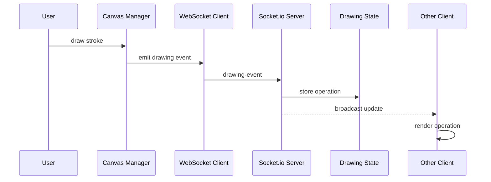

# Collaborative Canvas


A real-time collaborative drawing app where multiple users sketch, annotate, and edit together.

## Feature Overview


1. Recent color history (up to 7 colors).
2. Shapes and text tools.
3. Image upload with drag and zoom.
4. Mobile-friendly touch controls.
5. Large canvas workspace.

## Architecture Overview

```mermaid
flowchart LR
  subgraph ClientLayer[Client Layer (Browser)]
    UI[UI (index.html)]
    Tools[UI Logic (main.js)]
    Canvas[Canvas Engine (canvas.js)]
    WSClient[WebSocket Client (websocket.js)]
    UI --> Tools
    Tools --> Canvas
    Tools --> WSClient
    Canvas --> WSClient
  end

  subgraph RealtimeLayer[Realtime Transport]
    Socket[Socket.io]
  end

  subgraph ServerLayer[Node.js Server]
    HTTP[Express Server (server.js)]
    Hub[Socket.io Hub (server.js)]
    Rooms[Room Manager (rooms.js)]
    State[Drawing State (drawing-state.js)]
    HTTP --- Hub
    Hub --> Rooms
    Hub --> State
  end

  ClientLayer <-->|draw events, presence| Socket
  Socket <-->|broadcast| Hub
```

## Data Flow



## Key Features

- Real-time sync for drawing, shapes, text, and image moves.
- Room-based sessions with shareable links.
- Toolset: brush, eraser, select/move, shapes, text, image upload.
- Admin tools for moderation and global history actions.
- Responsive layout for desktop and mobile.

## How It Works

1. Join or create a room. Use `?room=your-room-id` to reuse the same room.
2. Share the URL to collaborate.
3. Draw on the canvas and use the sidebar tools to edit.

## Usage Notes

- Scroll wheel or pinch to zoom. Drag with two fingers to pan on mobile.
- Use Select to move or resize images.
- Tap the arrow button to collapse or expand the toolbar on mobile.

## Tech Stack

- Frontend: Vanilla JS, HTML5 Canvas, CSS.
- Backend: Node.js, Express.
- Real-time: Socket.io.

## Setup

1. Clone the repo:
   ```bash
   git clone https://github.com/tanveerhkit/collaborative-canvas-flam-.git
   ```
2. Install dependencies:
   ```bash
   npm install
   ```
3. Start the server:
   ```bash
   npm start
   ```
4. Open `http://localhost:3000`.

## Testing

Manual checks:

- Open two tabs in the same room and verify live updates.
- Draw shapes, text, and images and confirm they sync.
- Resize the window and confirm the canvas content stays aligned.
- Test mobile width and confirm the toolbar toggle works.

Built for the FLAM assignment.
