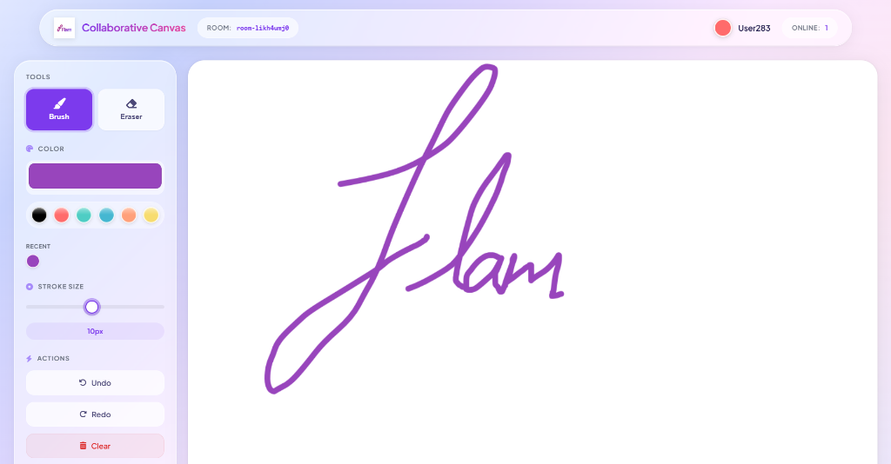
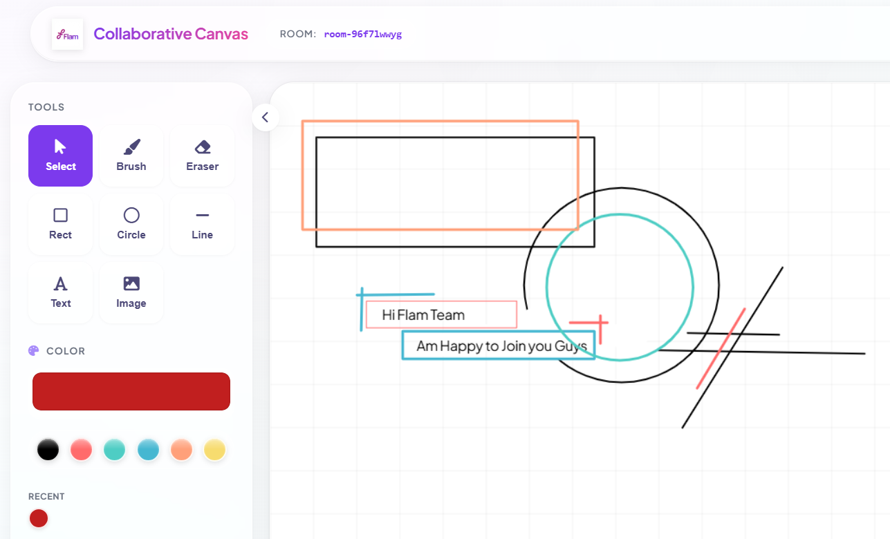
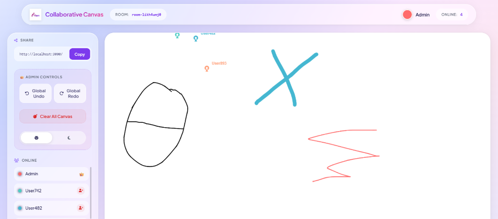
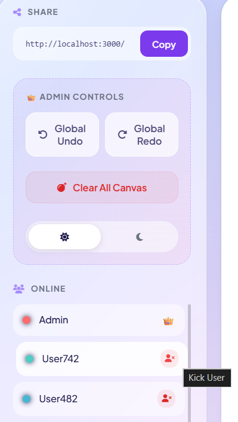

# Collaborative Canvas 🎨



> **Experience seamless creativity.** A real-time collaborative drawing platform where multiple users can sketch, brainstorm, and create together instantly.

## Feature Overview



1. Added features for selecting upto 7 recent colors
2. Added shapes and Text feature
3. User can add image and also drag them and zoom in and zoom out
4. Complete mobile touch responsive
5. Very large canvas area

## ✨ Key Features

### 🚀 Real-Time Collaboration

- **Instant Sync**: See every stroke from every user as it happens.
- **Multi-User Presence**: Watch "Ghost Cursors" glide across the screen, showing exactly where others are working.
- **Room-Based Sessions**: Create private rooms (`?room=unique-id`) to collaborate with specific groups.

### 🛠️ Professional Tools
- **Dynamic Brush Engine**: Smooth, quadratic-curve rendering for natural stroke feel.
- **Smart Tools**: Brush, Eraser, and Color Picker with recent history.
- **Premium UI**: A glassmorphism-inspired interface with dark/light mode support.

### 🛡️ Admin System

- **Role Management**: Room creators get Admin status (👑).
- **Moderation**: Admins can kick disruptive users.
- **Global Actions**: Admins can undo/redo *any* action or clear the board for everyone.

---

## 🎮 How it Works

1.  **Join a Room:** Open the app. You'll be assigned a unique Room ID (or enter one).
2.  **Share the Link:** Send the URL to friends. They join instantly.
3.  **Start Creating:**
    *   **Draw:** Left-click and drag.
    *   **Pick User:** See who is who by their cursor label.
    *   **Theme:** Toggle the 🌙 icon for Dark Mode.

## 🎁 Bonus Features
*   **Global Undo/Redo**: Unlike standard apps, our history is shared. An admin can "rewind" the entire session state.
*   **Adaptive Layout**: The "Floating Dock" UI adapts perfectly to tablets and mobile screens.
*   **Network Resilience**: Intelligent batching ensures smooth drawing even on slower connections.

## 🛠️ Tech Stack
*   **Frontend**: Vanilla JS + HTML5 Canvas (No heavy frameworks).
*   **Backend**: Node.js + Express.
*   **Real-Time**: Socket.io (WebSockets).
*   **Styling**: Pure CSS3 (Variables, Flexbox, Glassmorphism).

## 🚀 Setup & Installation
1.  **Clone the repo**:
    ```bash
    git clone https://github.com/tanveerhkit/collaborative-canvas-flam-.git
    ```
2.  **Install dependencies**:
    ```bash
    npm install
    ```
3.  **Run the server**:
    ```bash
    npm start
    ```
4.  **Open Browser**: Go to `http://localhost:3000`.

---
*Built with ❤️ for FLAM Assignment*

